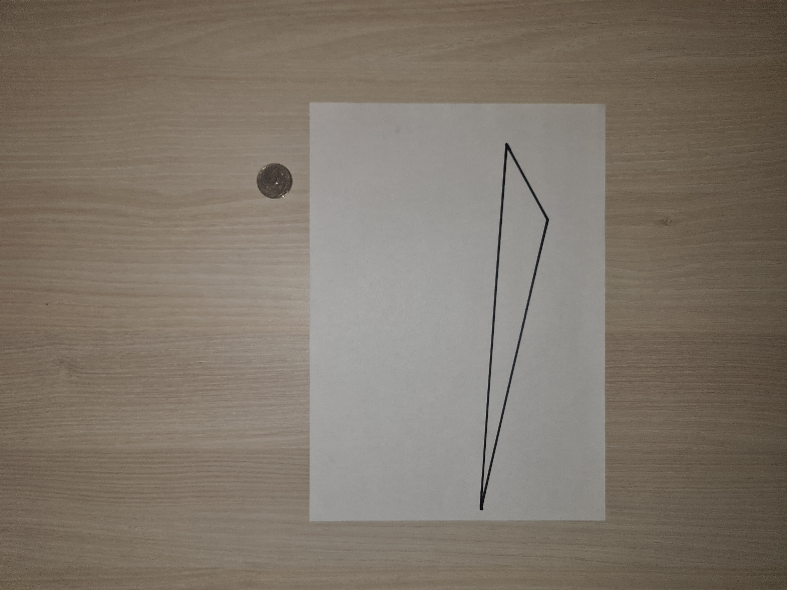

# intelligent-placer: Собранные данные

## Репрезентативная выборка

### Крайне малый многоугольник: о его размере заранее известно только то, что в него не поместится ни один из объектов выборки.

1.1) Крайне малый многоугольник и малый объект: ответ должен быть False

1.2) Крайне малый многоугольник и большой объект: ответ должен быть False

1.3) Крайне малый многоугольник и много небольших объектов: ответ должен быть False

### Малый многоугольник: заранее известно, что в него из выборки помещается только монета и медиатор.

2.1) Малый многоугольник и малый объект: ответ должен быть True

2.2) Малый многоугольник и объект, сопоставимых габаритов, но слегка не вписываемый из-за круглой формы: ответ должен быть False

2.3) Малый многоугольник и большой объект: ответ должен быть False

### "Хитрый" многоугольник: тупоугольный, но очень длинный треугольник, в который по площади могло бы поместиться много предметов из выборки, но заранее известно, что поместится только жвачка, медиатор и монета (и то, только по одному).

3.1) "Хитрый" многоугольник и малый объект: ответ должен быть True

3.2) "Хитрый" многоугольник и жвачка: ответ должен быть True

3.3) "Хитрый" многоугольник и "повернутая" жвачка: ответ должен быть True (т.е. алгоритм должен еще уметь "поворачивать" предметы, чтобы уместить их)

### Обычный многоугольник: равнобедренный остроугольный треугольник, в который, как заранее известно, могут помещаться несколько маленьких или пара средних объектов.

4.1) Обычный многоугольник и много малых объектов: ответ должен быть True

4.2) Обычный многоугольник и один средний объект: ответ должен быть True

### Гигантский многоугольник: заранее известно, что в него могут поместиться абсолютно все предметы выборки за 1 раз (без повторов предметов)

5.1) Гигантский многоугольник и все объекты: ответ должен быть True

## Остальные тестовые изображения

0.1) Крайне малый многоугольник и пара малых объект: ответ должен быть False

0.2) Малый многоугольник и много разных объектов: ответ должен быть False

0.3) "Хитрый" многоугольник и много объектов: ответ должен быть False

0.4) "Хитрый" многоугольник и небольшой объект, чуть больше монеты: ответ должен быть False

0.5) Обычный многоугольник и малый объект: ответ должен быть True

0.6) Обычный многоугольник и много разных объектов: ответ должен быть Falses

0.7) Гигантский многоугольник и малый объект: ответ должен быть True

0.8) Гигантский многоугольник и много малых объектов: ответ должен быть True

